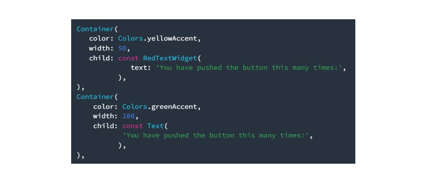

# flutter_pluggin_pubdev

## Hasil Praktikum


### Tugas Praktikum

1. Jelaskan maksud dari `flutter pub add auto_size_text` pada praktikum tersebut! 

   - Mendaftarkan package/plugin auto_size_text ke dalam pubspec.yaml menggunakan perintah tersebut di terminal.


2. Jelaskan maksud dari gambar dibawah ini pada praktikum tersebut!
   
   
   -  Membuat variabel text yang nantinya dibutuhkan sebagai argumen dalam constructor RedTextWidget. Ketika contructor digunakan di main.dart, maka fungsi RedTextWidget akan meminta widget text, widget text tersebut akan dirubah stylenya sesuai dengan fungsi RedTextWidget.


3. Pada gambar dibawah ini terdapat dua widget yang ditambahkan, jelaskan fungsi dan perbedaannya!
   

   - Pada widget container pertama, fungsi yang digunakan adalah RedTextWidget yang dimana style tulisan akan berwarna merah, sesuai dengan fungsi RedTextWidget. Sedangkan widget container kedua menggunakan widget Text biasa yang style tulisannya standar dari widget Text tersebut.


4. Jelaskan maksud dari tiap parameter yang ada di dalam plugin auto_size_text berdasarkan tautan pada dokumentasi [ini](https://pub.dev/documentation/auto_size_text/latest/) !
   
   - **maxLines**

    ```
    AutoSizeText(
        'A really long String',
        style: TextStyle(fontSize: 30),
        maxLines: 2,
    )
    ```

   

    Parameter maxLines digunakan untuk membatasi garis maksimal text yang akan diberi, jika parameter tidak diisi maka akan disusaikan dengan tinggi dan lebar dari widget.
    
    - **minFontSize & maxFontSize**
   
    ```
    AutoSizeText(
        'A really long String',
        style: TextStyle(fontSize: 30),
        minFontSize: 18,
        maxLines: 4,
        overflow: TextOverflow.ellipsis,
    )
    ```

    

    Parameter minFontSize & maxFontSize digunakan untuk memberikan batas minimal dan maximal dari text yang akan diberi.

    - **group**

    ```
    var myGroup = AutoSizeGroup();

    AutoSizeText(
    'Text 1',
    group: myGroup,
    );

    AutoSizeText(
    'Text 2',
    group: myGroup,
    );
    ```
    
    

    Parameter group menyamakan style dari text yang akan diberi di group tersebut.
